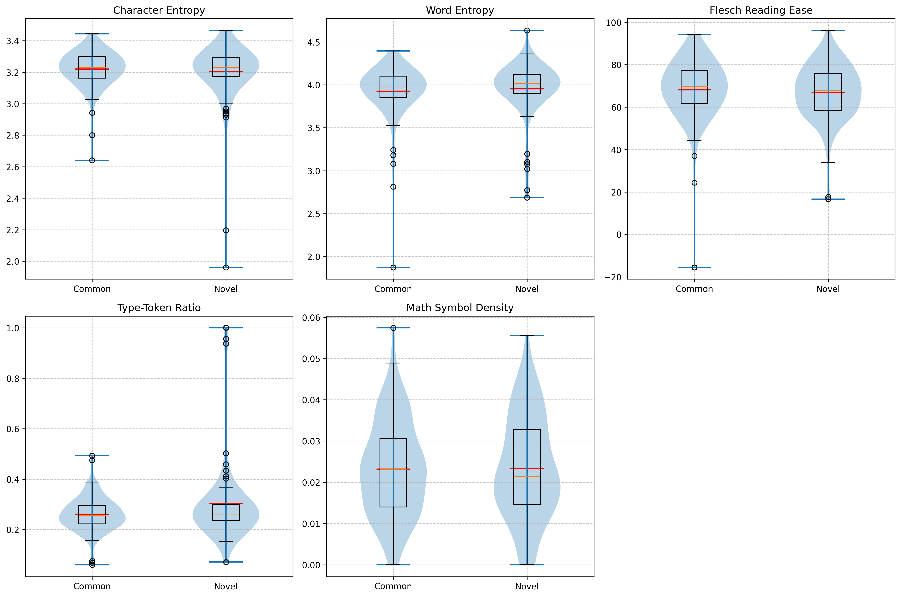
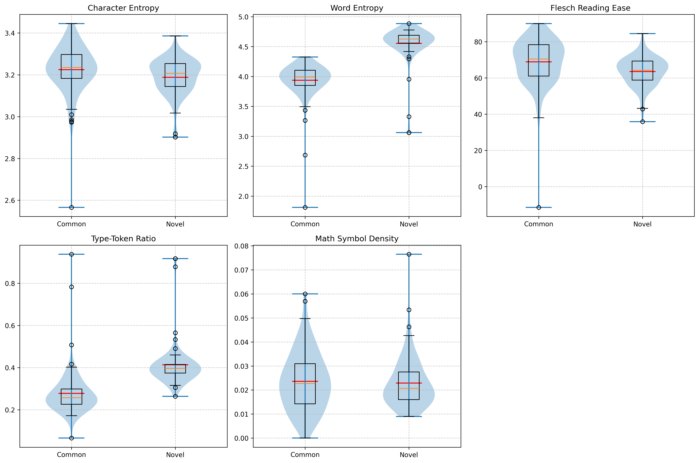
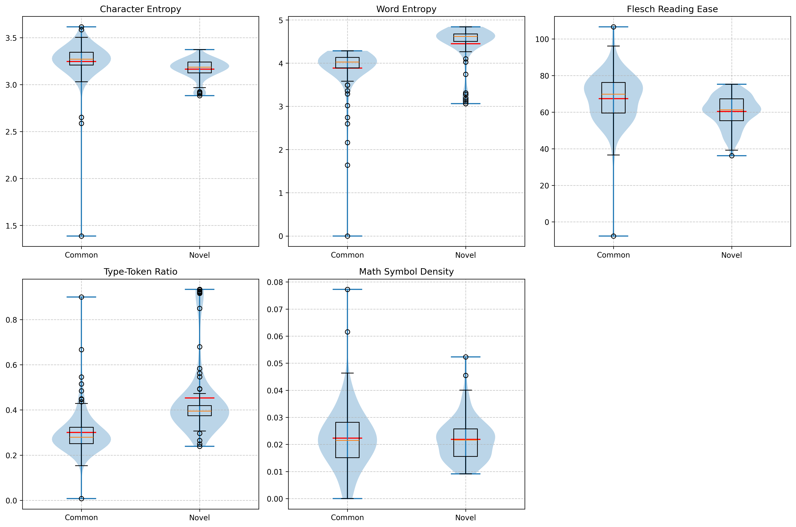

# CuriosityMath

## Motivation
Suppose we have a nice prompt, which can trigger LLMs' curiosity to solve math problems in a much more novel way. 

How to define the novelty of the solution? We suppose that the novelty increases when the LLM's temperature increases. So our goal is to find a prompt that enables reasoning at a lower temperature to achieve the same novel solutions as those produced at a higher temperature.

Which may also lead to a increase of the LLM's reasoning ability and accuracy.

## Pipeline

base_model download and save
    Qwen2.5-Math-7B
    Qwen2.5-Math-72B
    NuminaMath-7B-TIR

dataset download and save:
    FrontierMath: https://arxiv.org/pdf/2411.04872(extremely challenging)
    OlympiadBench: https://arxiv.org/html/2402.14008
    OmniMath: https://arxiv.org/pdf/2410.07985
    MATH Level 5 & MetaMath

## Simple statics results

### 1. Basic Prompt

### 2. Incontext Learning

### 3. Eazy Prompt

